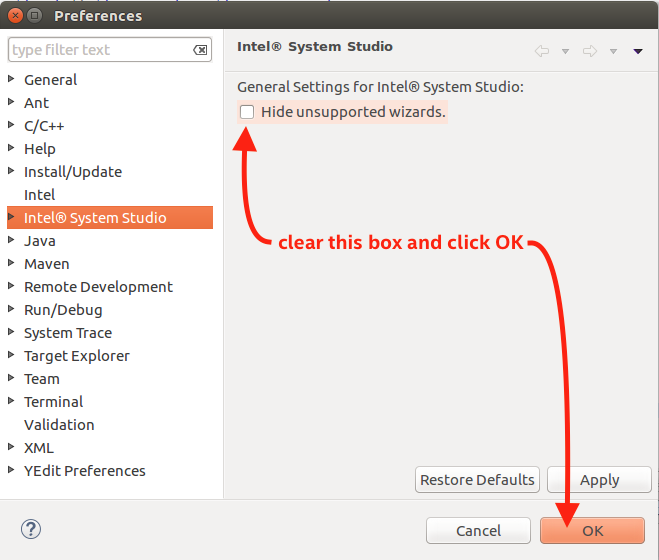
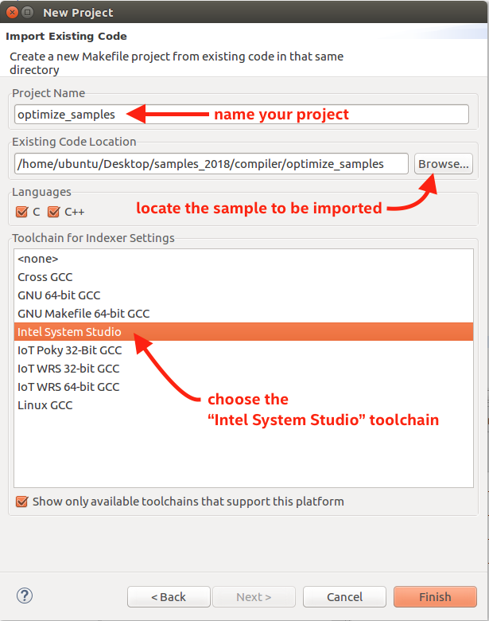
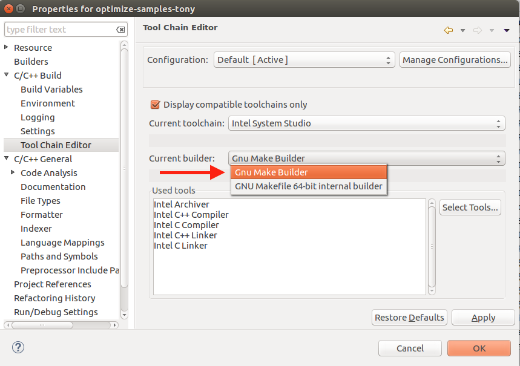
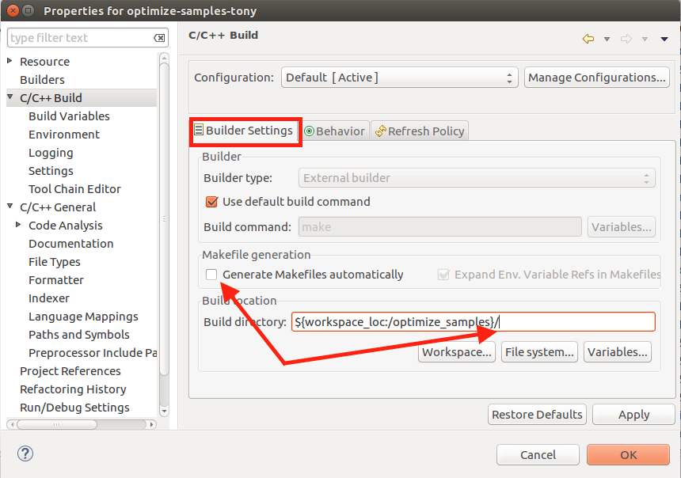
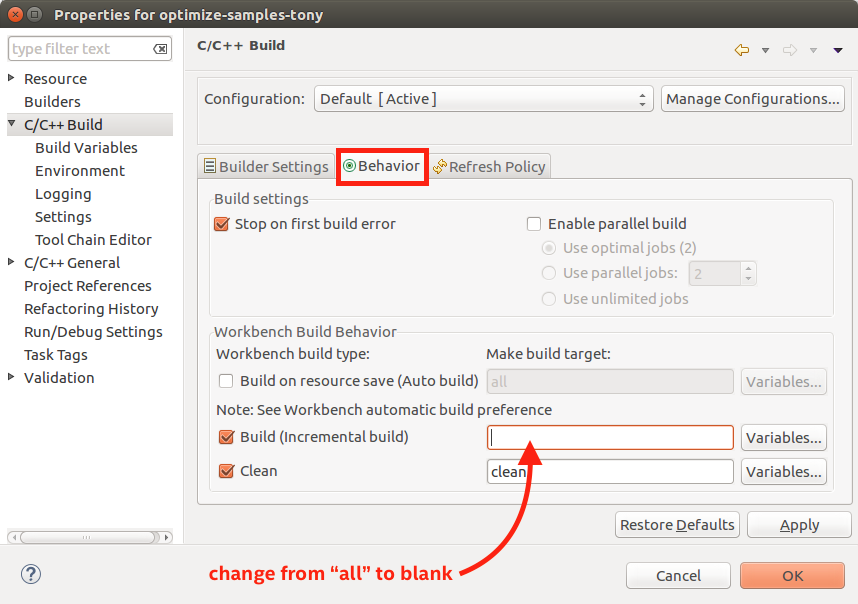

Samples for Intel® System Studio
================================

These samples illustrate features of many of the components included with Intel
System Studio. They are organized into folders that correspond to which
component they belong; for example, `compiler` contains Intel Compiler (`icc`)
samples, `gdb` contains Intel Debugger samples, etc.

>   Ignore any instructions within the `readme` files found in the sample
>   folders that reference installing Intel® Parallel Studio or Microsoft\*
>   Visual Studio.

Most of these samples *do not* have a proper Eclipse\* `.project` file for easy
import into the Intel System Studio development environment. For use within
Intel System Studio (i.e., within Eclipse) follow the instructions below.

>   **IMPORTANT!** At this time, these import instructions work *only* with
>   Intel System Studio for Linux.

Copy the Samples to Your Development System
-------------------------------------------

The simplest way to get a copy of the samples in this repo is to [download this
ZIP file][1] and expand it on your development system. Alternatively, you can
`git clone` this repo directly onto your system. See the green **Clone or
download** button for details on how to clone this repo.

[1]: https://github.com/intel-system-studio/samples/archive/master.zip

Import a Sample into Intel System Studio (Eclipse)
--------------------------------------------------

>   **IMPORTANT!** When you use the import procedure defined below, Eclipse will
>   *"import in place."* This means the sample folder will be converted to an
>   Eclipse project, it *will not* be copied to your Eclipse workspace folder as
>   part of the import. If you want the sample to be located within your Eclipse
>   workspace you must first *copy* or *move* the sample to your workspace
>   folder before importing it.

These instructions will import the sample as a user-managed makefile project.
That is, all compile and link instructions are specified in a `Makefile`
supplied with the sample. This means you must modify the sample's `Makefile` to
make changes to the build process, for example, if you want to change compiler
optimization options. This can be done by opening the sample's `Makefile` in an
Eclipse edit window, since a makefile is an editable text file.

If a sample *does not* include a `Makefile` it cannot be imported using the
procedure described below. In that case, if the sample includes an Eclipse
`.project` file you can use the Eclipse import tool (`File > Import… > General >
Existing Projects into Workspace`) to open that project for use within Intel
System Studio.

>   It is also possible to use the command-line to build these projects, outside
>   of Intel System Studio. That usage is outside the scope of this README.

### Enable "unsupported" wizards

~~~~~~~~~~~~~~~~~~~~~~~~~~~~~~~~~~~~~~~~~~~~~~~~~~~~~~~~~~~~~~~~~~~~~~~~~~~~~~~~
Window > Preferences > Intel System Studio
~~~~~~~~~~~~~~~~~~~~~~~~~~~~~~~~~~~~~~~~~~~~~~~~~~~~~~~~~~~~~~~~~~~~~~~~~~~~~~~~

Clear the box labeled *"Hide unsupported wizards."* and click the **OK** button.

>   NOTE: on Apple\* macOS\* the Preferences dialog is located in the
>   `Intel(R)System Studio` menu, not the `Window` menu.

### Import as a makefile project

~~~~~~~~~~~~~~~~~~~~~~~~~~~~~~~~~~~~~~~~~~~~~~~~~~~~~~~~~~~~~~~~~~~~~~~~~~~~~~~~
File > Import > C/C++ > Existing Code as Makefile Project
~~~~~~~~~~~~~~~~~~~~~~~~~~~~~~~~~~~~~~~~~~~~~~~~~~~~~~~~~~~~~~~~~~~~~~~~~~~~~~~~

Click the **FINISH** button.

>   Locate the folder that contains the `Makefile` for the sample you are
>   importing.

### Modify toolchain build details

Make sure you have selected (highlighted) your newly imported project in the
**Project Explorer** window.

Open the project properties so you can fine tune the build commands:

~~~~~~~~~~~~~~~~~~~~~~~~~~~~~~~~~~~~~~~~~~~~~~~~~~~~~~~~~~~~~~~~~~~~~~~~~~~~~~~~
Project > Properties > C/C++ Build > Tool Chain Editor
~~~~~~~~~~~~~~~~~~~~~~~~~~~~~~~~~~~~~~~~~~~~~~~~~~~~~~~~~~~~~~~~~~~~~~~~~~~~~~~~

Make sure the "**Current builder:**" field is configured to use the "**Gnu Make
Builder**."

Select the **C/C++ Build** item from the list of properties on the left. Make
sure the "**Build Settings**" tab is selected and clear the "**Generate
Makefiles automatically**" checkbox is cleared. Also, be sure the "**Build
directory:**" field points to the root of your project (assuming that is where
the project `Makefile` is located).

On the same property panel, select the "**Behavior**" tab and clear the
"**Build (Incremental build)**" field so it is blank, as shown in the image
below. Optionally, you can set this field so match one of the `Makefile` build
make targets.

>   **NOTE:** If you choose to not use the default or "blank" make target you
>   will have to inspect the sample's `Makefile` for options. The precise name
>   of the make targets that can be used depend on how the sample's `Makefile`
>   has been written. Most of the samples have multiple make targets.

### Build and run the project

Now that your project is configured, you can perform a build and run the build
sample as you would with any Eclipse project.

If a blank make target does not work, or does not build what you need,  review
the sample's `Makefile` and README files for information regarding the make
targets available in that sample's `Makefile`, and update the make target name
in the "**Build (Incremental build)**" field on the "**Behavior**" tab of the
"**C/C++ Build**" properties panel to match the desired make target.

For example, if you want the Eclipse builder to perform a `make debug` with
your project (assuming `debug` is a valid make target in your sample's
`Makefile`), then change the "**Build (Incremental build)**" field on the
"**Behavior**" tab of the "**C/C++ Build**" properties panel from an empty
(blank) field to one that says `debug`. Now, when you perform a build of your
project it will execute a `make debug` command.

>   The README file inside the sample you have imported may include a
>   description of the make target(s) that can be used with this sample. Usually
>   this information is in a section of the README titled *"for Linux command-
>   line users"*). If the README file is an html file (`readme.html`) you can
>   view it directly in the Eclipse edit window by double-clicking that file
>   within the Eclipse Project Explorer.

### \* [Trademark Information][2]

[2]: https://www.intel.com/content/www/us/en/legal/trademarks.html
